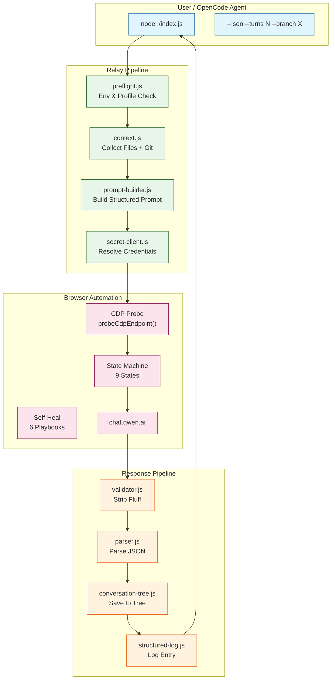
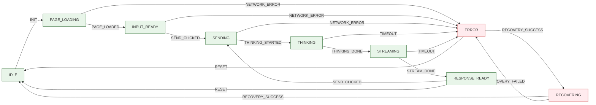
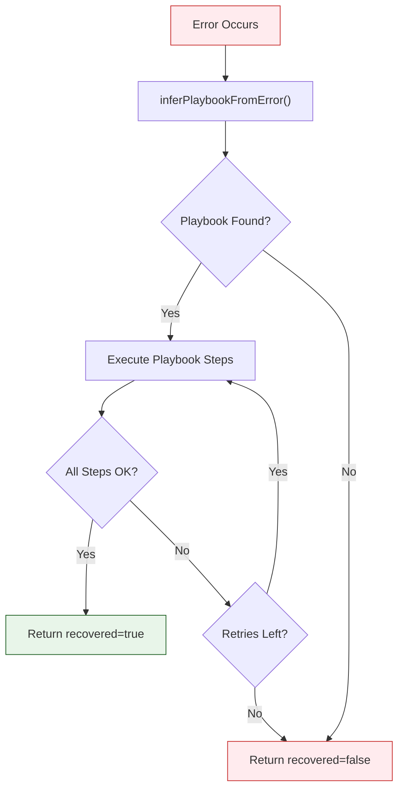
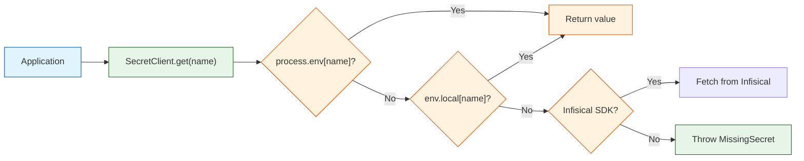
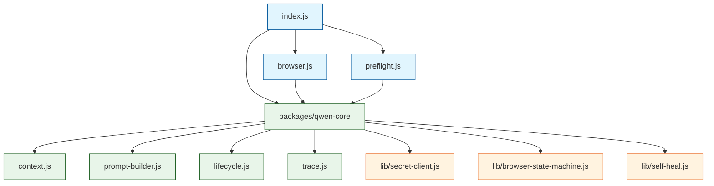

# Architecture

> Detailed system design for coder-SIN-Qwen relay proxy.

## System Overview

## State Machine

## Self-Healing Playbooks

## Recovery Playbooks

| Playbook                   | Triggers                                 | Steps                                             |
| :------------------------- | :--------------------------------------- | :------------------------------------------------ |
| AUTH_MODAL_VISIBLE         | `auth`, `login`, DOM contains "Anmelden" | Click sign-in → wait for email field → verify     |
| MODEL_SELECTOR_CHANGED     | `model`, `selector`                      | Click dropdown → wait for list → select preview   |
| THINKING_TOGGLE_MISSING    | `thinking`, `denken`                     | Click selector → open dropdown → select option    |
| SEND_BUTTON_STALE          | `send`, `stale`, `detached`              | Wait for DOM update → click with force → fallback |
| SESSION_EXPIRED            | `session`, `expired`                     | Navigate to chat → wait → re-authenticate         |
| ASSISTANT_RESPONSE_MISSING | `response`, `timeout`                    | Wait longer → retry wait → verify                 |

## Secret Management Flow

## Package Dependencies

## Key Design Decisions

| Decision                     | Rationale                                   |                     ADR                     |
| :--------------------------- | :------------------------------------------ | :-----------------------------------------: |
| UI automation over API       | Full Qwen feature access without API limits |    [ADR-0001](adr/0001-ui-automation.md)    |
| Sidecar CDP attach only      | No profile locks, clean process separation  | [ADR-0002](adr/0002-sidecar-cdp-attach.md)  |
| pnpm + Turborepo             | Strict module isolation, cache-efficient CI | [ADR-0003](adr/0003-pnpm-turbo-monorepo.md) |
| Zero-trust SecretClient      | Secrets never logged, typed access          |  [ADR-0004](adr/0004-secret-management.md)  |
| Local JSON conversation tree | Portable, no DB, supports branching         |  [ADR-0005](adr/0005-conversation-tree.md)  |
